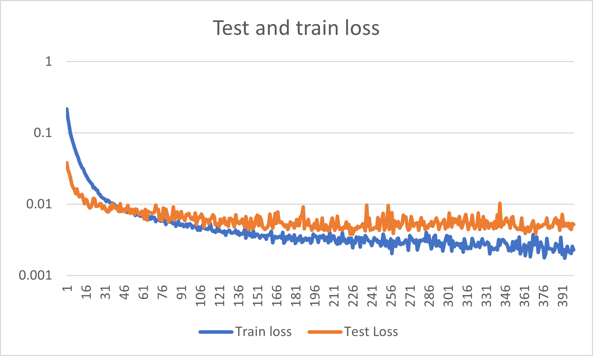

# structure_2_reflectance_ML
A custom ML regression for making multispectral reflectance prediction algorithms from paired SEM image and multispectral reflectance inputs

I have implemented a Residual block architecture based Convolutional Neural Network framework adapted for spectral reflectance prediction from structural SEM images in Pytorch.

Thus far I have tested this code on a single NVIDIA GPU node with 26-28GB memory in the Harvard RC high performance computing environment (Rocky8 OS). Workflow here assumes the python code is submitted by a job submitted to a high performance compute environment via slurm.
The code is designed to take a csv file as input with a series of hyperparameters over a given number of epochs and then train the algorithm. At each epoch, it tests the accuracy on 15% of the original paired dataset that was randomly split and set aside as a test dataset.
If the model is more accurate (as an average across the 10 different channels) than the previous best accuracy, the model parameters are saved, such that the best performing model can be retained from any run regardless of whether subsequent training begins to degrade ther performance.


## Submitting jobs
submit using sbatch:
```
sbatch struct2refl_model_running_hyperparam_tuning_saving.sh \
fourier_struct2refl_model_running_hyperparam_tuning_saving.py \
'/PATH/TO/DIR/climate_change_solution_structural_image_reflectancevalues_dataset_updatedstructural_prunedmagnification.csv' \
{BATCHSIZE} {LEARNINGRATE} {EPOCHS} {WEIGHTDECAY} \
'/PATH/TO/SAVEDIR/' \
'DESCRIPTIVE_PREFIX_STRING' \
'NORM_METHOD_STRING'
```
The first argument passed to sbatch is the python training tuning file (either the fourier version that integrates features extracted via an identical pathway from fourier transfomed SEM images, or the original SEM only).

The second argument given to sbatch is a string that defines the directory and filename of a csv file containing 256x256 SEM image filenames and paths as strings in the first column, and ten subsequent columns denoting reflectance (or fluorescence) (0-1) in the UV, Blue, Green, Red, 740nm IR, 940nm IR, blue-fluorescence, green-fluorescence, red-fluorescence and maximal polarization intensity (across visible blue/green/red channels).

The third argument is the batch size (float). Currently, the best accuracy has been obtained with a value of 6

The fourth argument is the Learning rate (float). Currently most accurate results with 0.001, though highly variable.

The fiftj argument is the number of epochs to train the algorithm (int). Currently training with 400 epochs (takes about 6-12 hours)

The sixth argument is the weight decay parameter for the optimizer (float). Best accuracy is being obtained with 1 e-06, but not zero or 1e-05 or higher

The seventh argument is a string denoting the full directory path for where to save the output models.

The eighth argument is a descriptive prefix string

The ninth argument is either 'group' or 'batch' or 'instance' currently, for whether groupnorm or instancenorm (for small or 1 batch sizes) or batchnorm (larger batch sizes) should be used


## Results (As of last update)
Using the new Fourier capable model with instance norm and a batch size of 1, with 0.0001 learning rate and 0.00001 weight decay, we can see the following test and train dynamics:

